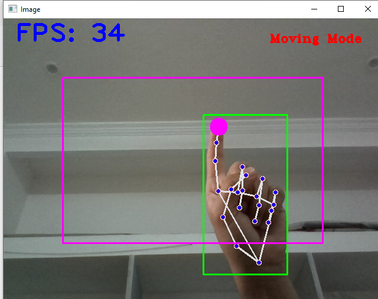
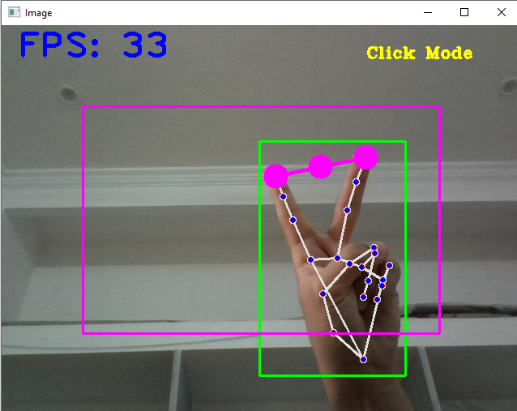
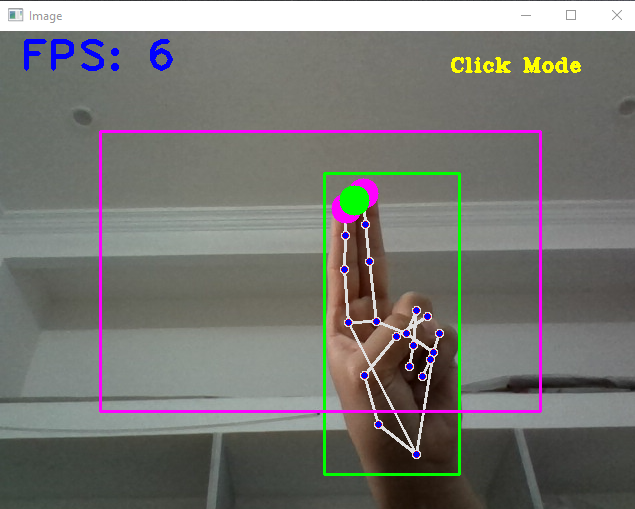

# AI-Virtual_mouse
I build a module using which we can control mouse from webcam or any other camera attached with the computer. We can perform various functions of mouse from fingers gesture.

  
